# Compilar un Kernel

## Notas importantes 
* Es necesario que nuesta maquina virtua tenga 30GB de almacenamiento, de otra forma la compulación fallará por falta de almacenamiento. 

* La práctica no se realizo correctamente debido a que en los 3 intentos me marcó que la memoria no era suficiente, incluso con la partición con 140GB.

Instalamos los paquetes necesarios de tal forma que 
 apt install build-essential libncurses-dev bison flex libssl-dev libelf-
dev bc dwarves -y

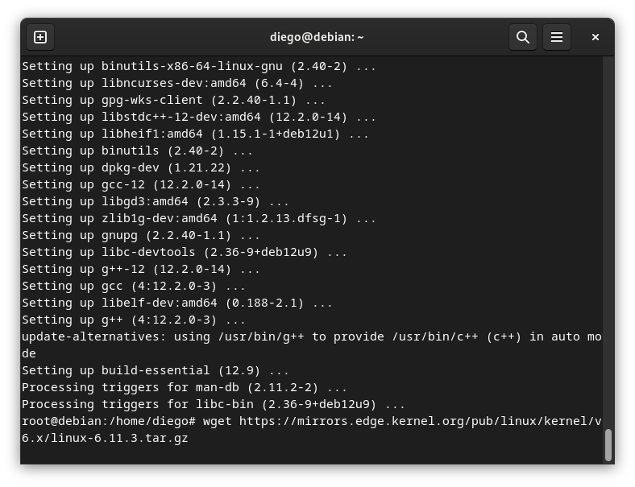

Descargamos el código fuente del kernel linux para debian12. Usaremos el link:

[kernel](https://mirrors.edge.kernel.org/pub/linux/kernel/v6.x/linux-6.11.3.tar.gz)
Extramos los archivos descargados
Copiamos la configuración de nuestro kernel actual e iniciamos la configuración del nuevo kernel

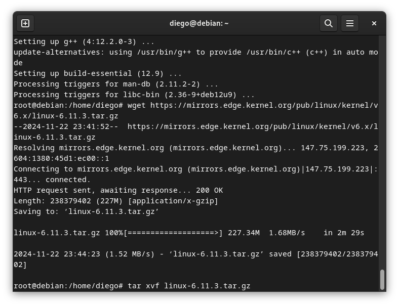
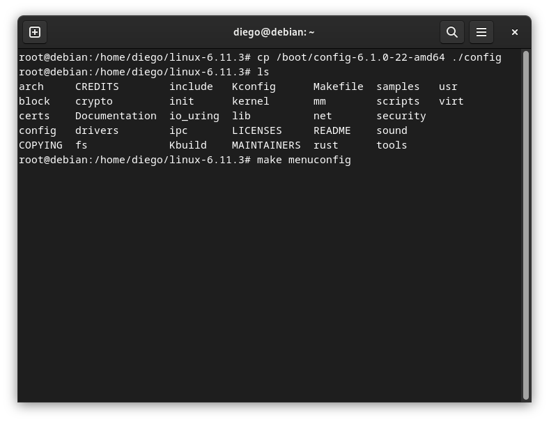
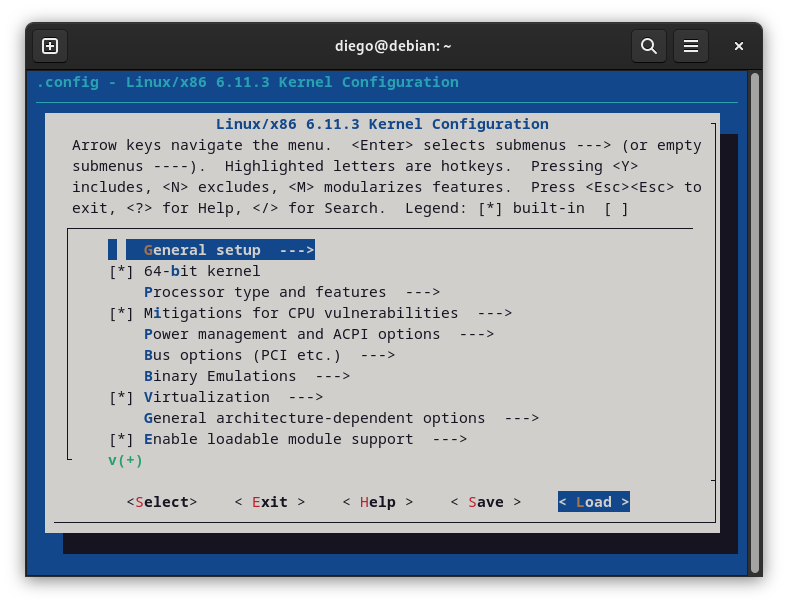
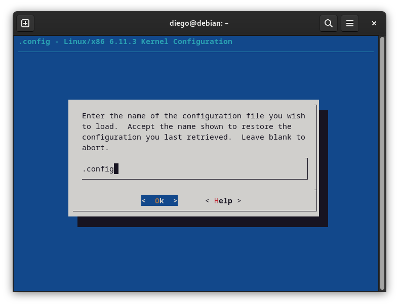
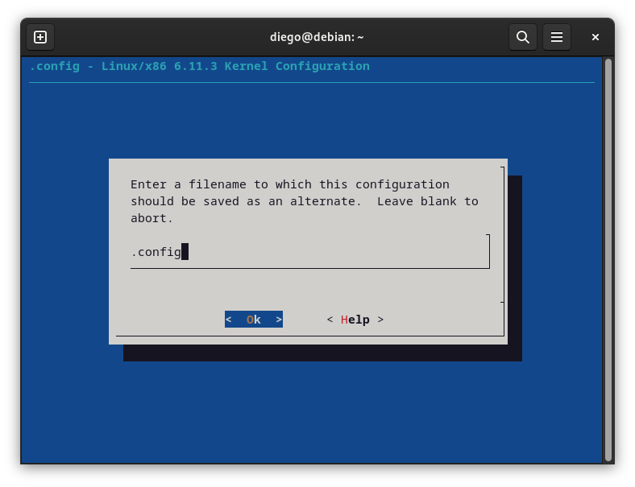
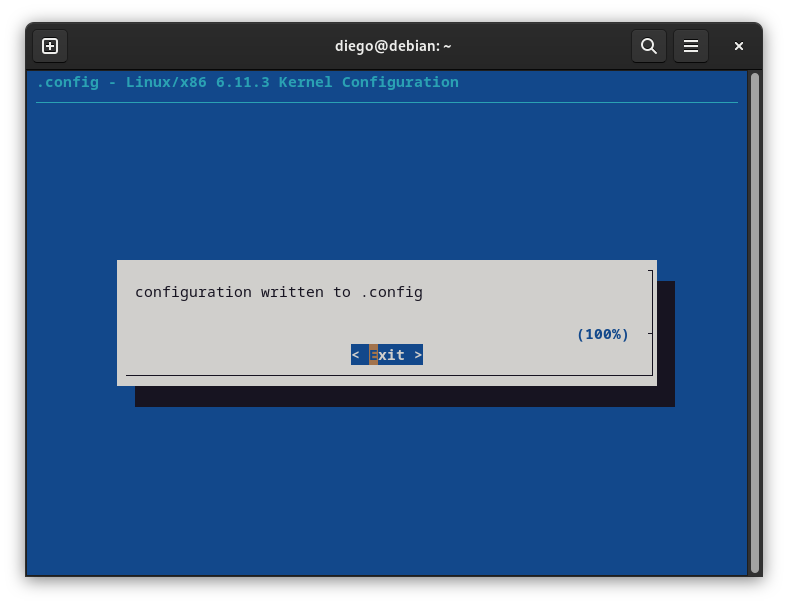
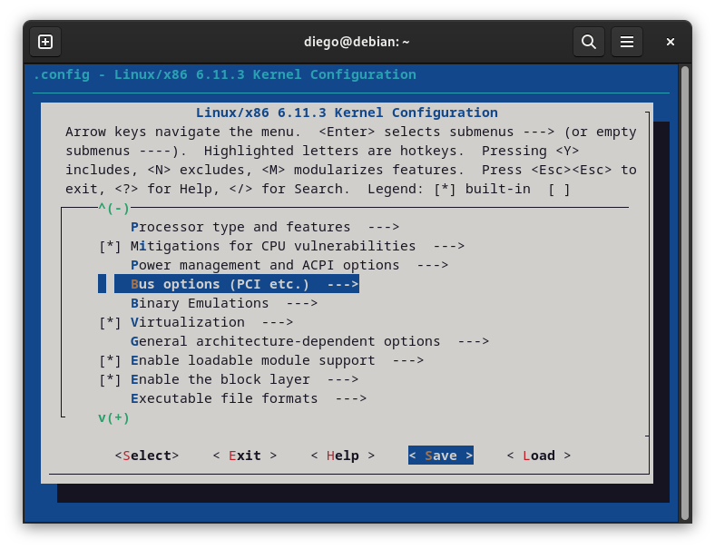

Compilamos nuestro kernel con todos los nucleos disponibles usando make -j $(nproc)

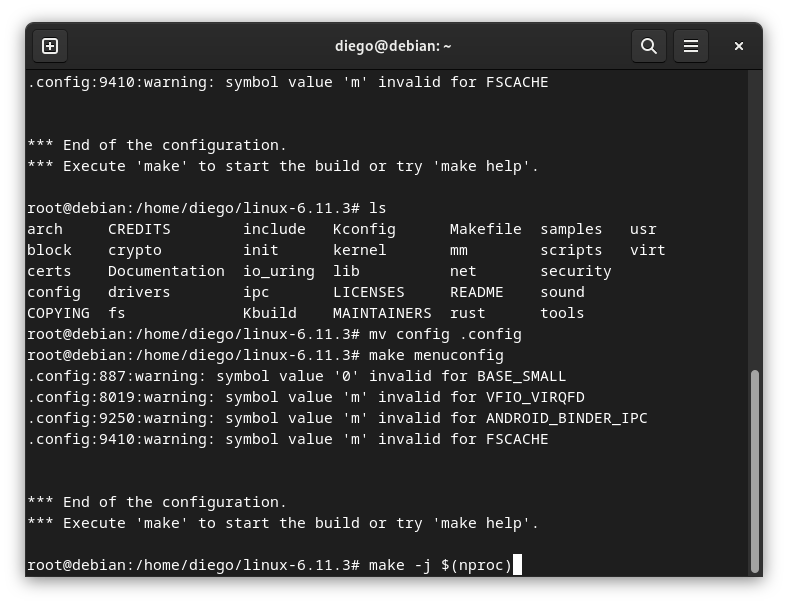
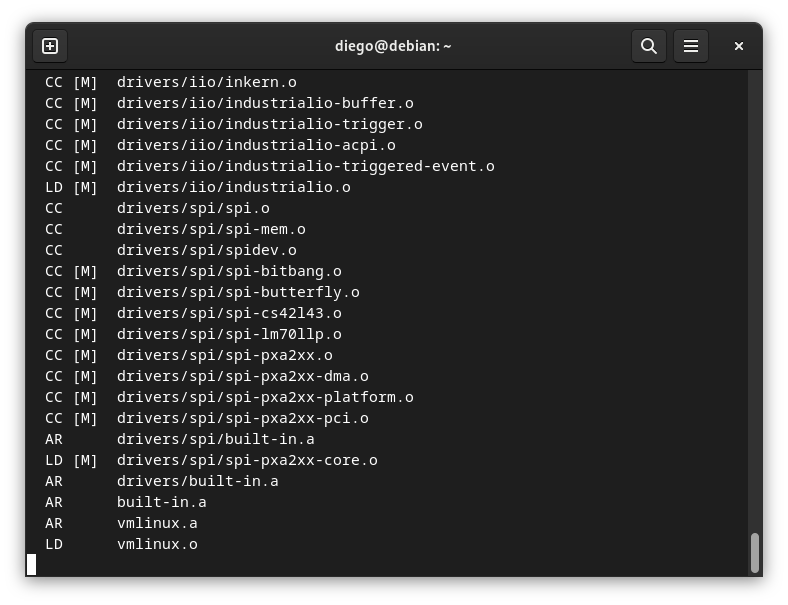
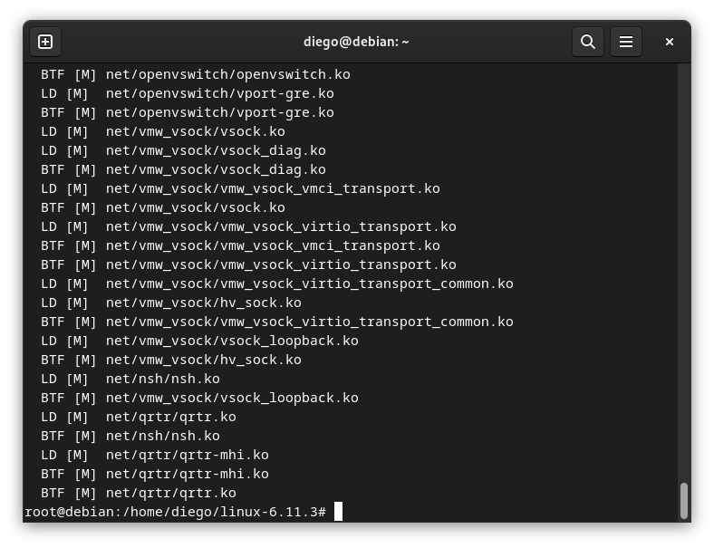
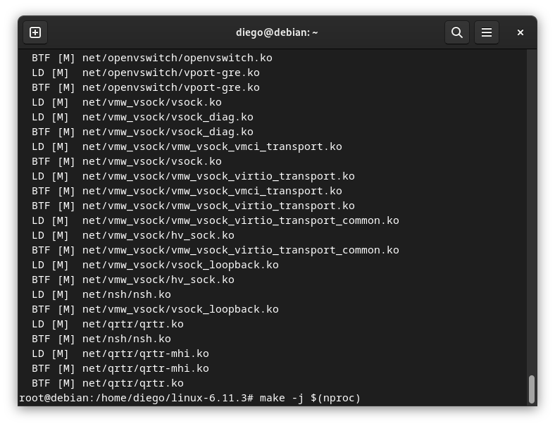
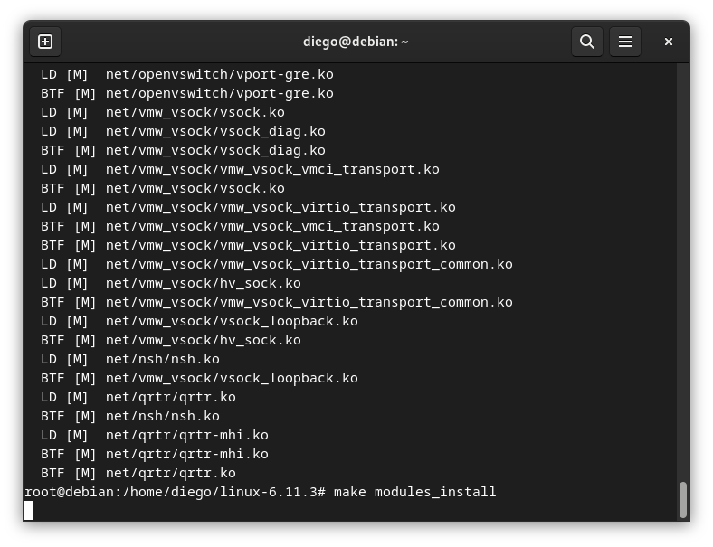

Instalamos los modulos usando make modules_install

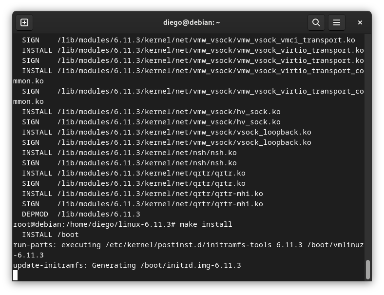
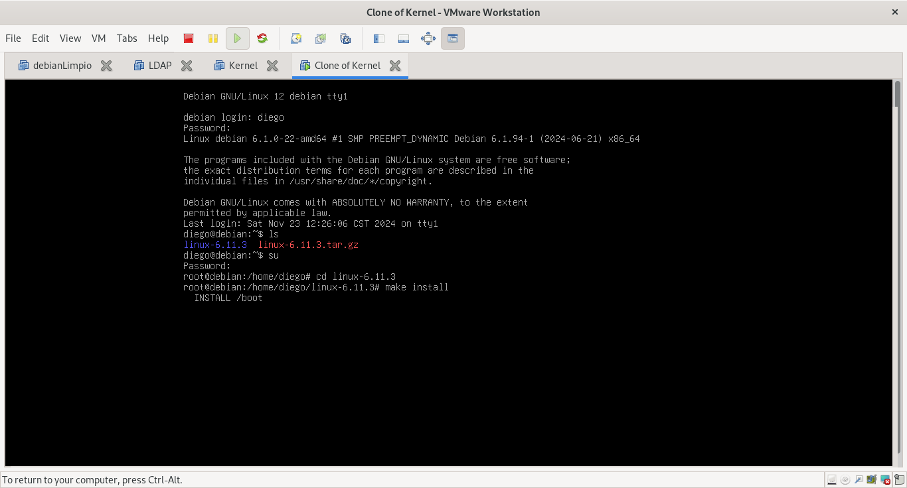
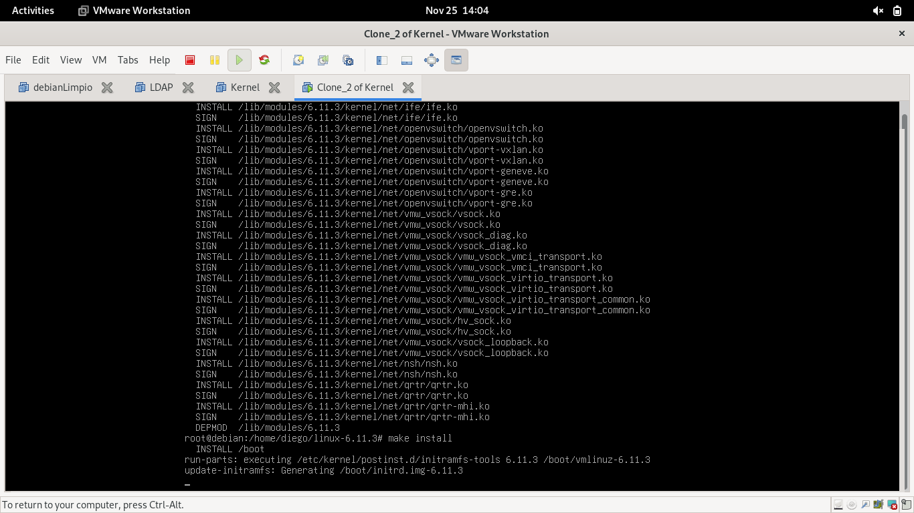
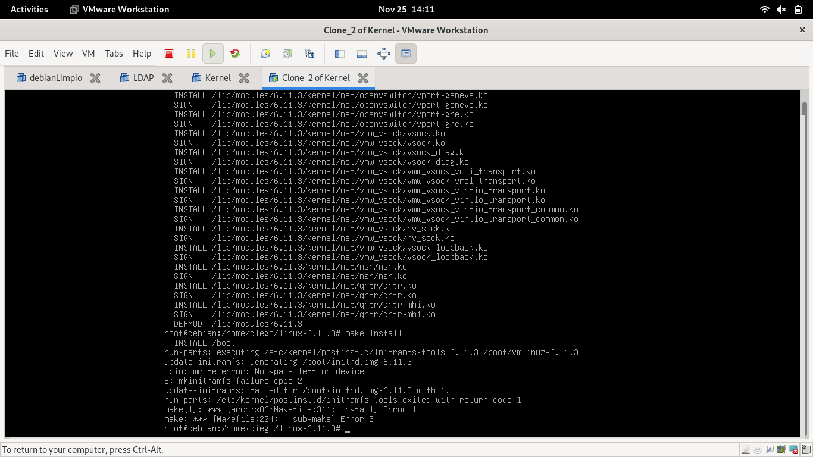
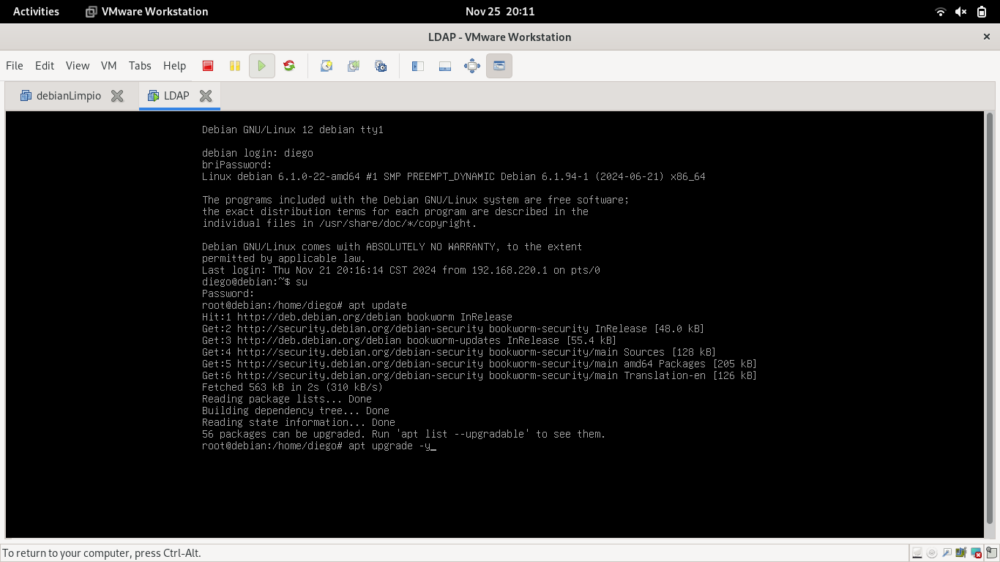

