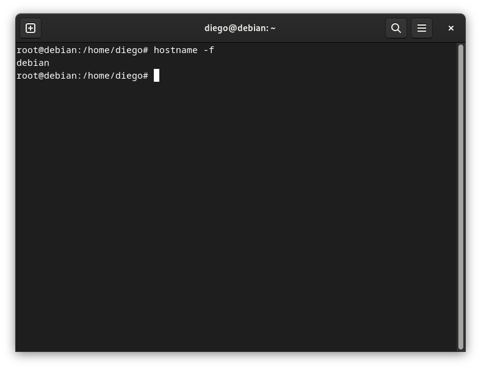
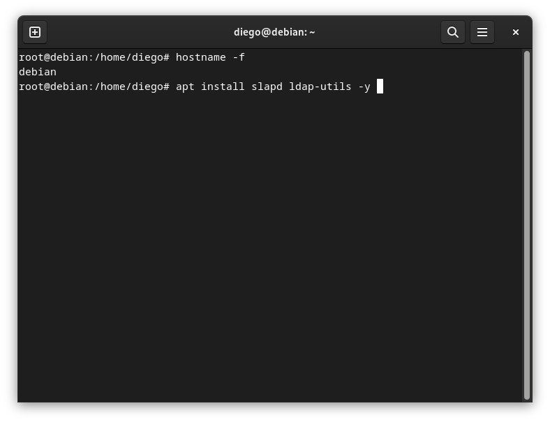
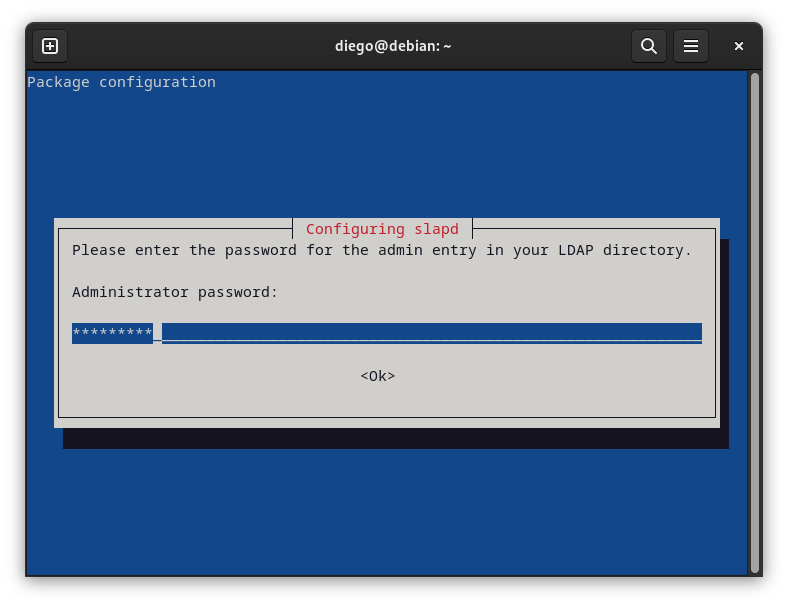
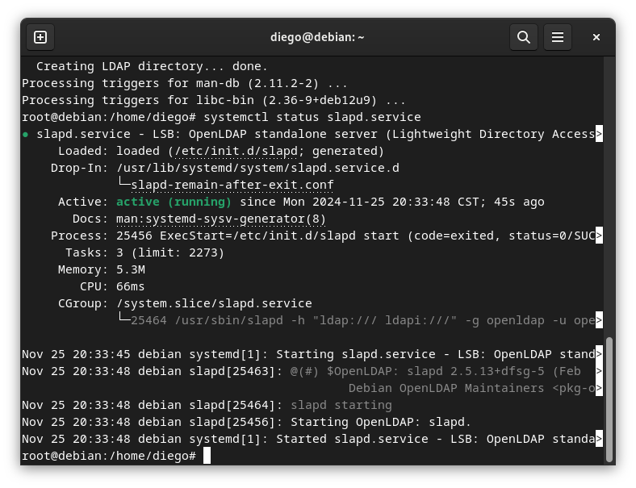
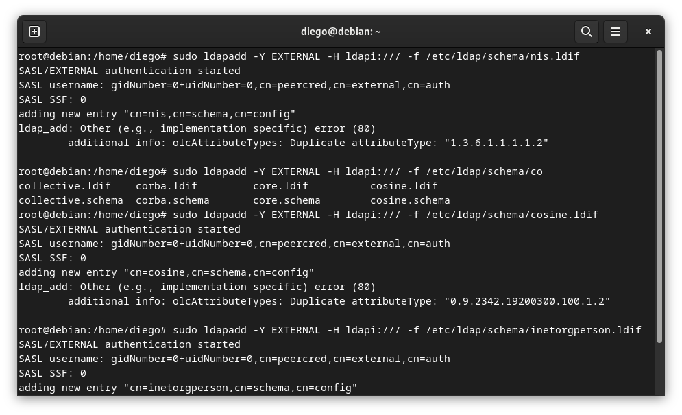
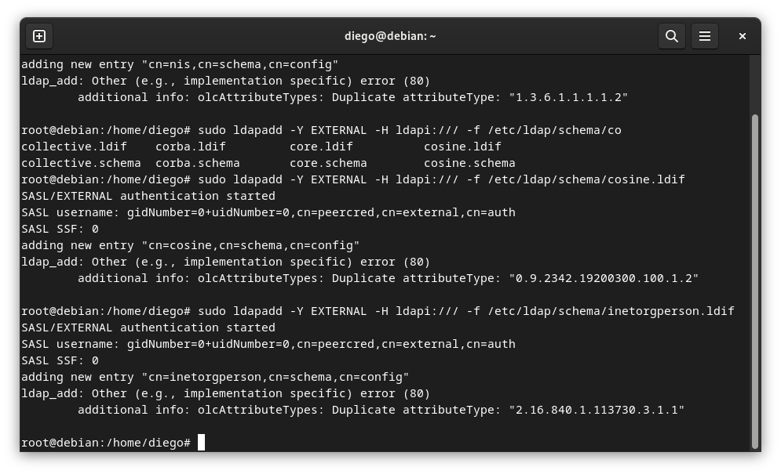

# Compilar un Kernel

## Notas importantes 
* Es necesario que nuesta maquina virtua tenga 30GB de almacenamiento, de otra forma la compulación fallará por falta de almacenamiento. 

* La práctica no se realizo correctamente debido a que en los 3 intentos me marcó que la memoria no era suficiente, incluso con la partición con 140GB.

