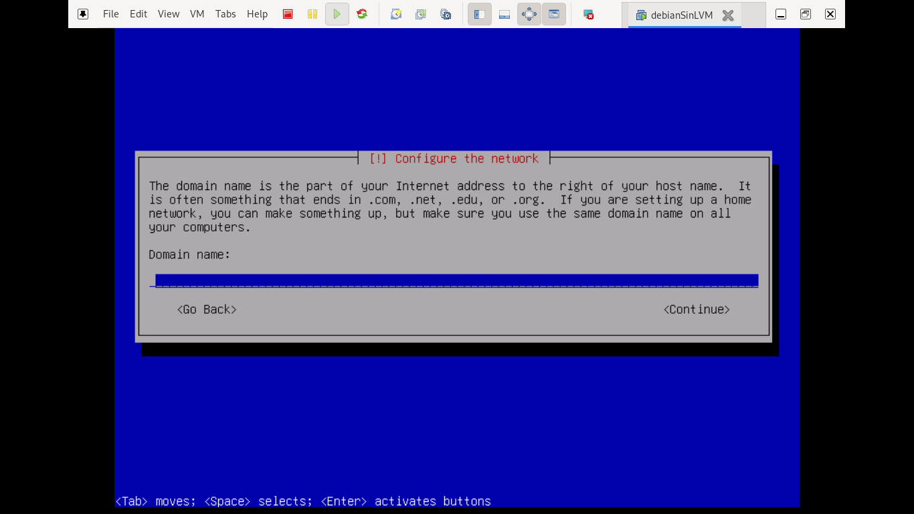

#Semana 1

## Instalación de VMware 

Primero ingresamos al enlace: https://blogs.vmware.com/workstation/2024/05/vmware-workstation-pro-now-available-free-for-personal-use.html 

Donde daremos click en la opción indicada para descargar Workstation pro download. Es a partir de esto que unicamente creamos la cuenta BROADCOM y completar el registro indicado para realizar la descarga 

# Linux sin LVM y particiones ad-hoc 

Una vez que hemos conseguido instalar VMware procederemos con la instalación de nuestra primer maquina virtual. Lo primero que debemos realizar es descargar la ISO correspondiente del debian.

Posteriormente abrimos VMware y crearemos una nueva maquina virtual.

Una vez creada procederemos a encender la maquina virtual

Siguiendo los pasos para la instalación 

